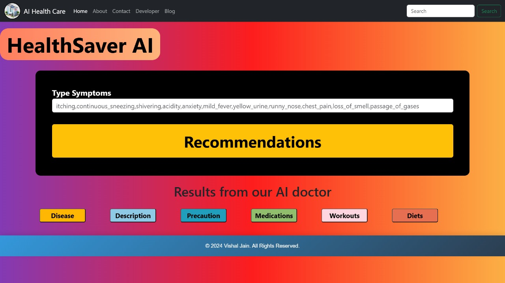
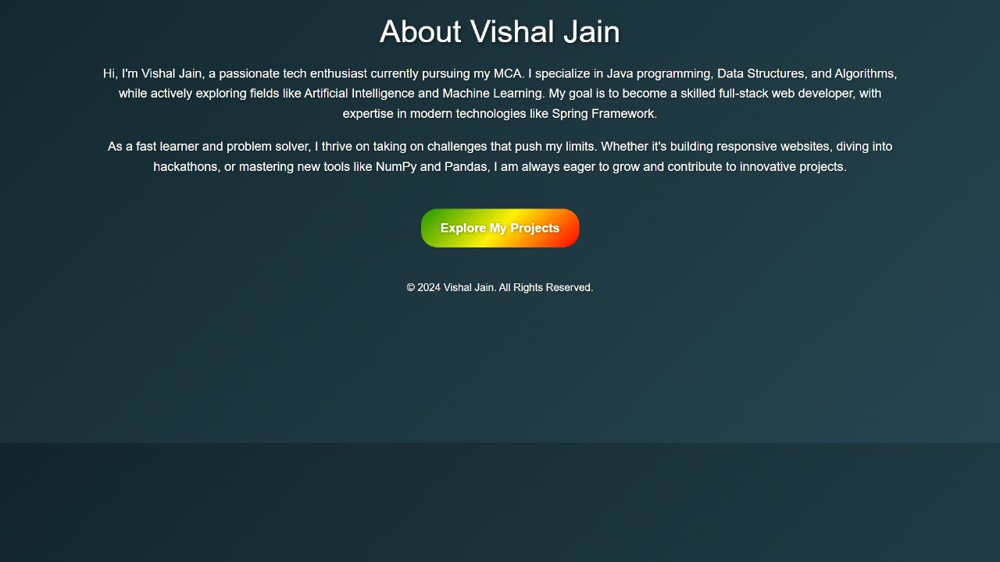

# HealthSaver AI

HealthSaver AI is an intelligent health recommendation system designed to assist users with accurate and personalized medicine recommendations based on their symptoms and health conditions. The application leverages artificial intelligence to provide expert-level suggestions.

## Features

- **Symptom Analysis**: Enter symptoms to get accurate medicine recommendations.
- **AI-driven**: Powered by a machine learning model trained on a diverse set of health data.
- **User-friendly**: Easy-to-use interface for seamless interaction.






[](HealthSaver%20AI.webm)

## Technologies Used

- Python
- TensorFlow / Keras
- Flask
- HTML, CSS, JavaScript
- Bootstrap

## Setup

To run this project locally, follow these steps:

1. Clone this repository:

   ```bash
   git clone https://github.com/Vishal-jain2003/HealthSaver_AI.git
